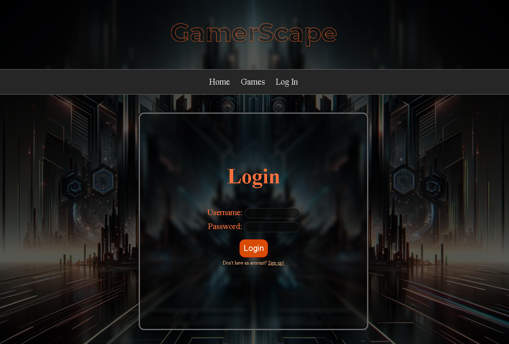
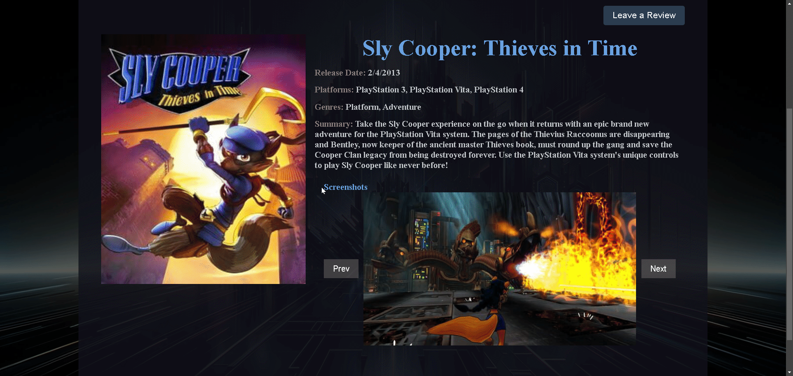
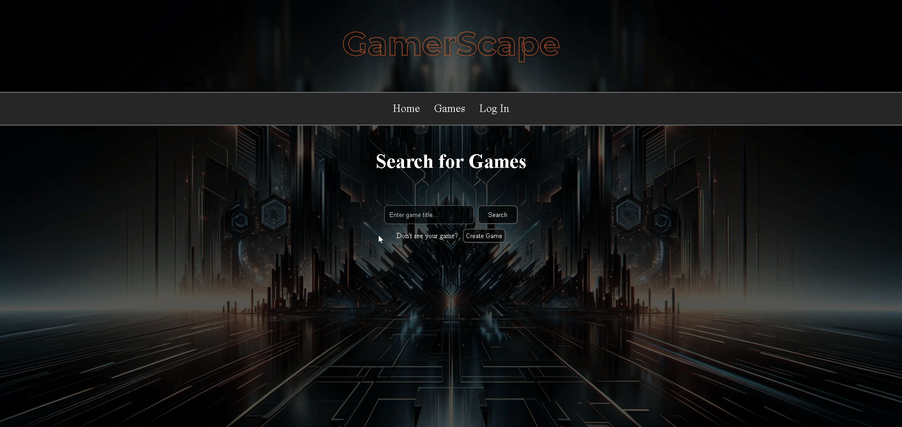

# GamerScape

## Description
Thank you for taking the time to visit my application. Welcome to GamerScape!

Ever feel like you want to not only browse certain games from any platform but also review them? Ever feel like you wish there was a getaway where gamers like yourself could have a community where we all recommend, save, and review games?

Fear no more! GamerScape has you covered!

GamerScape is an application where gamers can browse games from all sorts of platforms and genres. On top of that, GamerScape empowers gamers to follow one another, see each others favorites and reviews! And though the application is still in it's early development, GamerScapr is every gamer's 'escape'!

## Visuals

Here is a walk-through of GamerScape.

Introduction - YouTube

https://youtu.be/zLldheCUBS0?si=Bszj5G4-yPdUwGXo


## Instructions
Once you have forked and cloned GamerScape, please do the following:

1. Open two terminals: The first will be for the back-end and the second will be for the front-end. Make sure to cd into the root directory for both, to start.
2. In your back-end terminal, input:
```bash
pipenv install
```
```bash
pipenv shell
```
This will install the necessary dependencies then activate the virtual environment!

3. Once that is done, cd into the server directory and input:
```bash
export FLASK_APP=app.py
```
```bash
python app.py
```
And, boom! The back-end is ready to go. Now for the front-end.

4. In your front-end terminal, input: 
```bash
npm install
```
5. Once that is done, cd into the client and input:
```bash
npm start
```
And... tada! GamerScape is before us!



## Usage

Now let's go through the application!

1. This is the login page, where a user will either log in or sign up! Feel free to create an account!


2. This is the profile page! As you can see, this page will hold all of the user information, such as username, email, reviews and favorites! This is where you are able to Delete or Edit your existing reviews, but we'll get to that later!

P.S.
Favorites coming soon!


3. Next we have the Games page. This will allow the user to search for any game they like. This will bring up the game with some initial information. Click 'See More' to bring up more information.


4. If you would like to, click the 'Leave a Review' button in order to submit a review. Once submitted, you will be routed back to your profile page to see your newly-created review!




5. If your game does not exist, feel free to create it with the 'Create Game' button! You'll be prompted to enter the information then shown your game! Feel free to leave a review for it as well.




6. Lastly, if you would like to Edit or Delete a review, simply press the Delete button or follow the prompts to edit a review. When the edit button is clicked, you will be prompted to re-enter submit the review, where you can correct/update it.


# Support

For any and all questions, concerns, or comments, please do not hesitate to reach out to me via email!

:envelope:: **martingarcia804@yahoo.com**

## Authors and acknowledgment

Many thanks go to the many communities online and the technical support agents from Flatiron, who were a tremendous help. And I am sure I speak for many programmers when I also say thank you to Google!